# 前端界面

这里是我们的小箱交云作业平台的前端界面

## 用户通用功能

### 登录

#### 地址

http://localhost:3000/login

（PS：注意 src/routes/LoginRouter.js中第九行的isAuthed修改为false，src/routes/PrivateRouter.js中第九行的isAuthed修改为false）

#### 示例

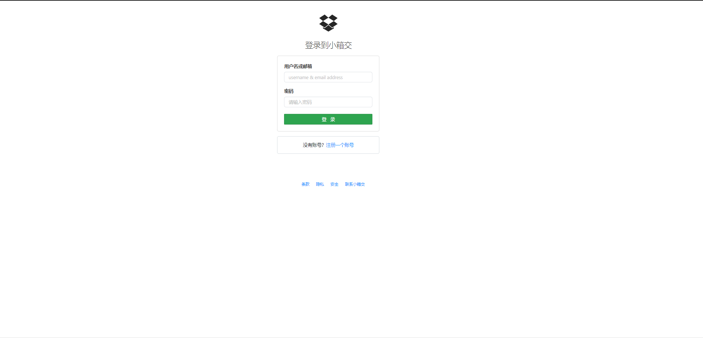

### 注册

#### 地址

http://localhost:3000/login

（PS：注意 src/routes/LoginRouter.js中第九行的isAuthed修改为true，src/routes/PrivateRouter.js中第九行的isAuthed修改为true，以下相同）

#### 示例

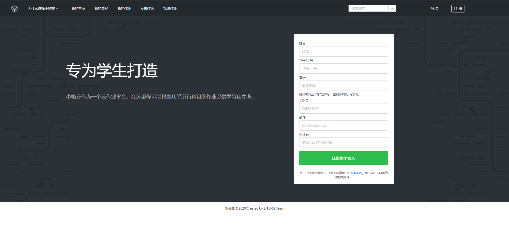

### 个人信息

#### 地址

http://localhost:3000/user

#### 示例

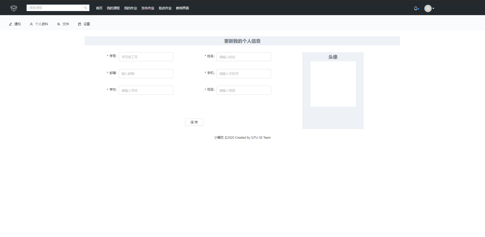

## 学生界面

### 主页

#### 地址

http://localhost:3000/

#### 示例

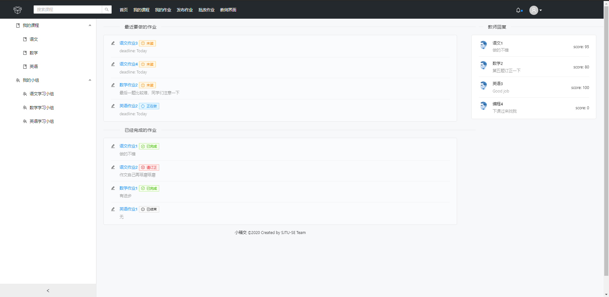

### 课程详情

#### 地址

http://localhost:3000/class

### 示例

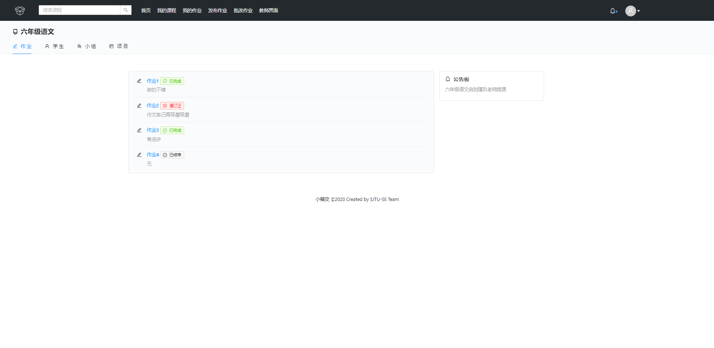

## 作业详情

### 地址

http://localhost:3000/homework

### 示例

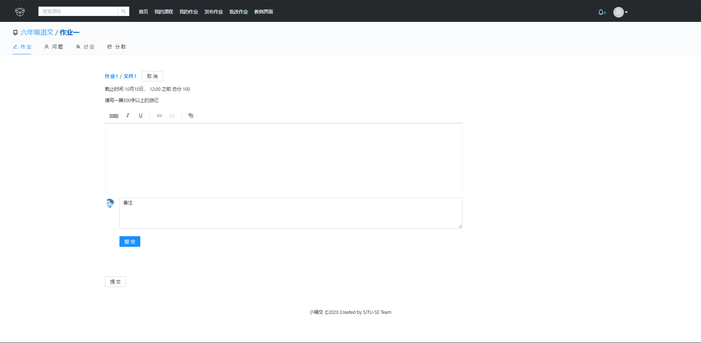

## 批改作业

### 地址

http://localhost:3000/correct

### 示例

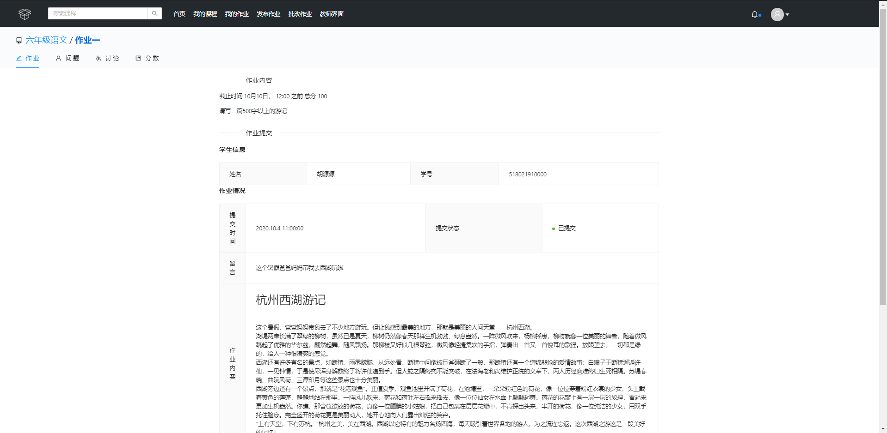

### 教师界面

### 地址

http://localhost:3000/teacher

### 示例

#### 主页

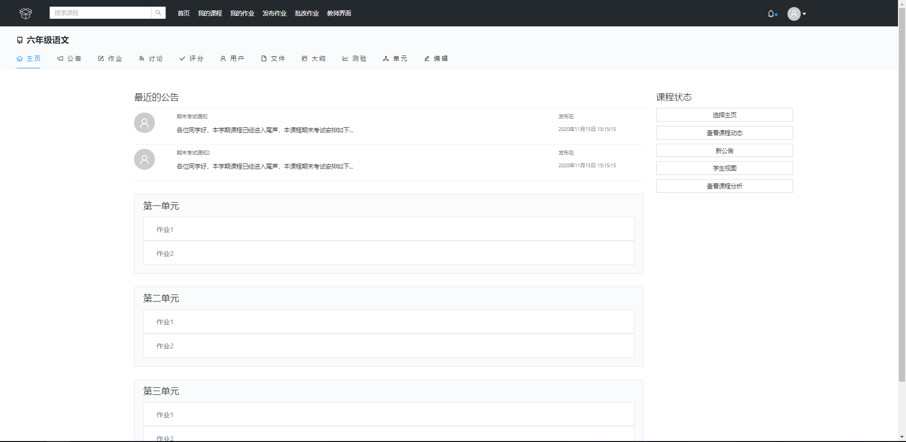

#### 公告

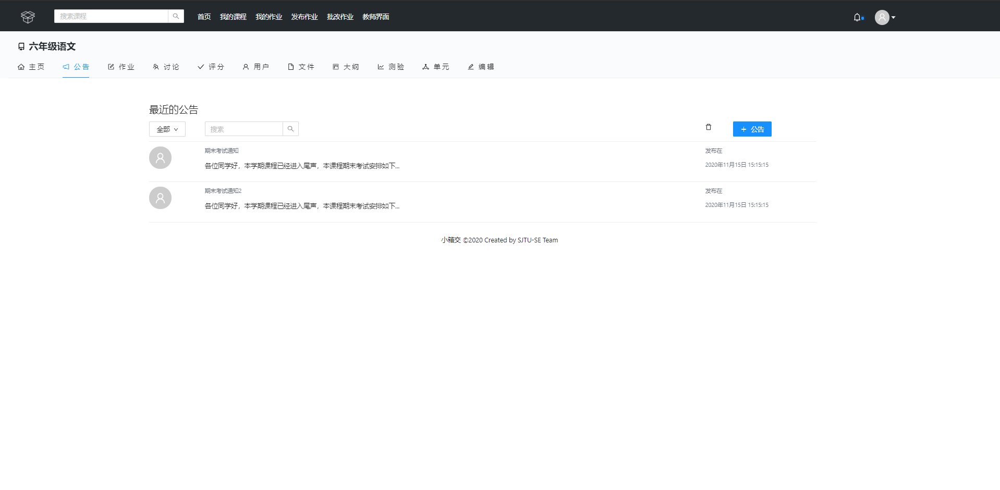

#### 作业

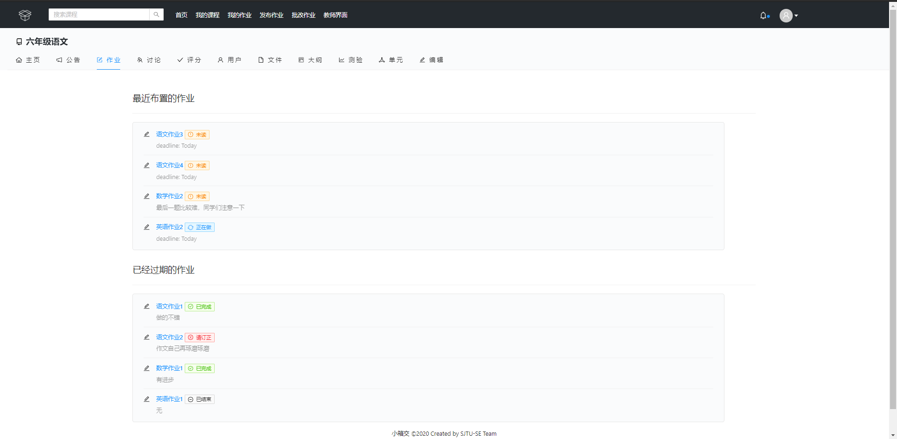

#### 讨论

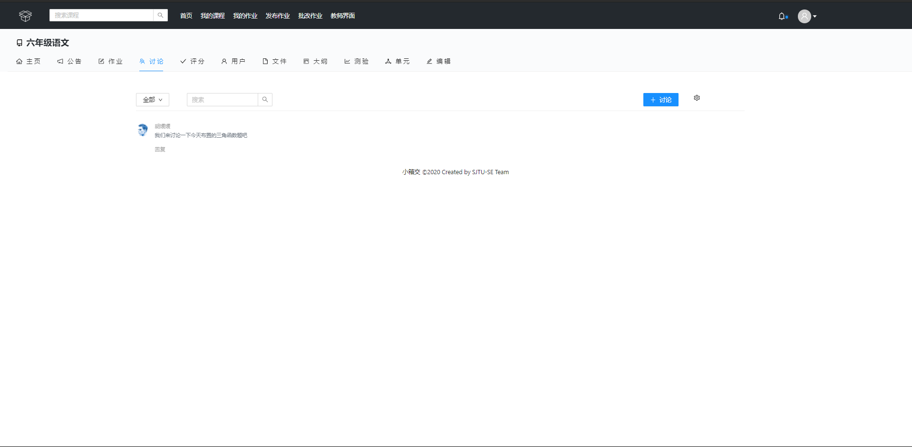

#### 用户

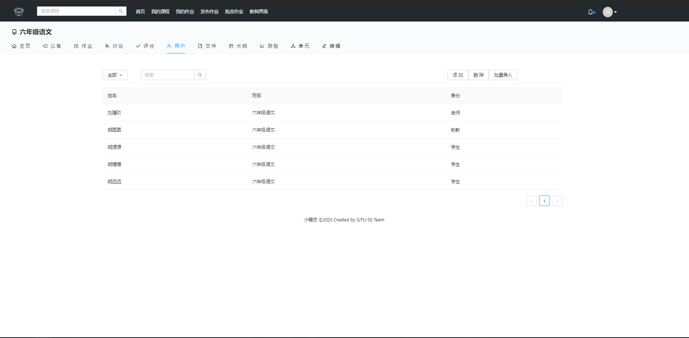

#### 大纲

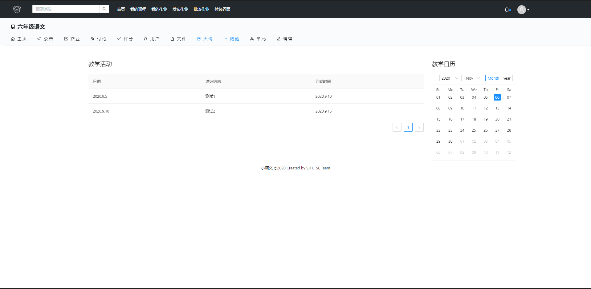

#### 单元

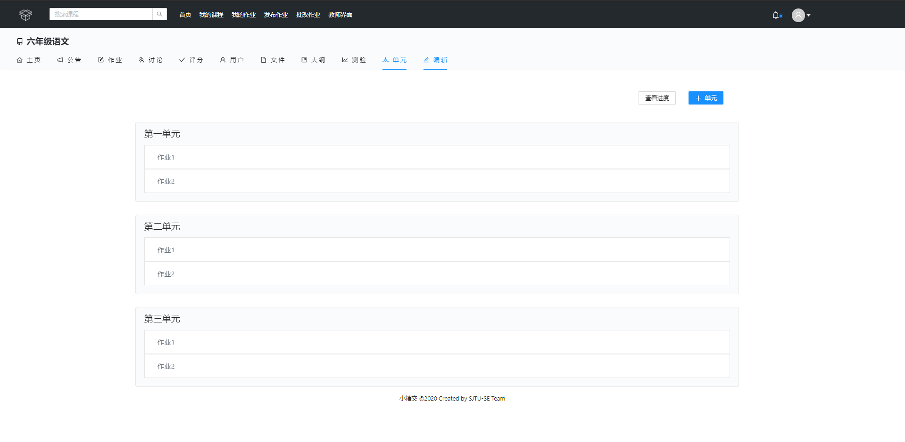

#### 编辑

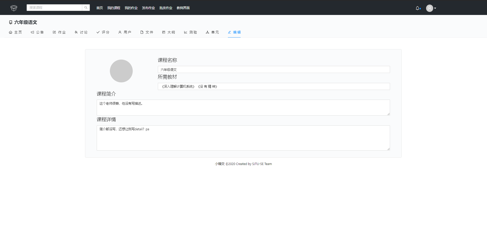